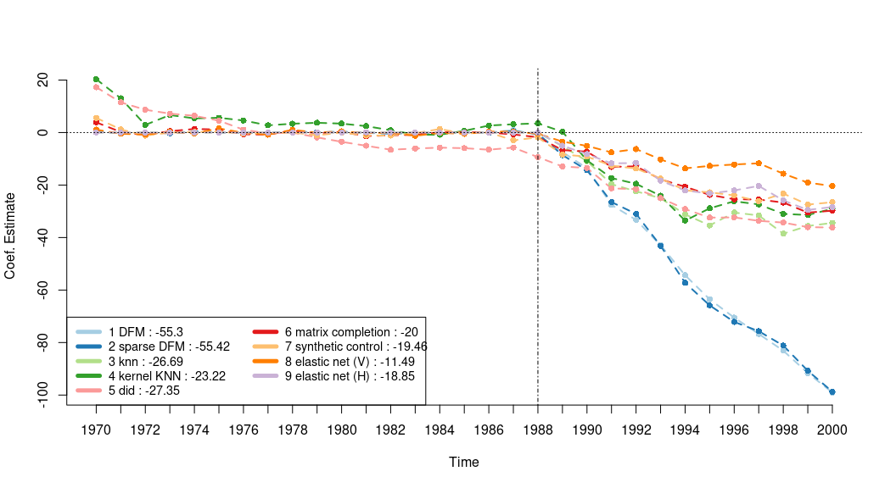

# `MCPanel`: Imputation Estimators for Causal Effects in Panel Data

Fork of [Athey et al’s MCPanel](https://github.com/susanathey/MCPanel/)
package with additional imputation methods for causal inference in panel
data. Supported imputation methods:

- matching (via `filling`)
- kernel matching (kernel PCA via `kernlab` followed by `filling`)
- dynamic factor model (`dfms`)
- sparse dynamic factor model (`sparseDFM`)
- matrix completion
- two-way FE / DID
- synthetic control
- horizontal ridge regression
- vertical ridge regression

These methods can all be implemented using the `imputation_ATT`
function. Inference can be performed using the bootstrap / jack-knife
(when number of treated units \> 1) using the `boot` library
\[implementation in progress\].

## Example

using Abadie, Diamond, Hainmueller (2010) California Prop 99 data.

``` r
# install.packages("apoorvalal/MCPanel")
pacman::p_load(MCPanel, synthdid) # for data
data(california_prop99)
```

`imputation_ATT` takes a panel data set, identifiers for unit, time,
treatment, and outcome, and a vector of method names (must be supported
by `imputationY`: includes
`"did", "dfm", "sdfm", "knn", "kknn", "nuclear", "hardimpute", "svdimpute", "optspace", "mc", "sc", "env", "enh"`).

``` r
# call all with defaults
est = imputation_ATT(
        california_prop99,
        "State", "Year", "treated", "PacksPerCapita",
        # method specific arguments are passed as lists
        # check docs for imputationY for details
        dfm_args = list(r = 4, p = 1),
        sdfm_args = list(r = 4, q = 2)
)
```

    ## Converged after 67 iterations.

``` r
# The print method returns ATT estimates.
print(est)
```

    ## ATT estimates

    ##               DFM        sparse DFM               knn        kernel KNN 
    ##            -55.30            -55.42            -26.69            -23.23 
    ##               did matrix completion synthetic control   elastic net (V) 
    ##            -27.35            -20.00            -19.46            -11.49 
    ##   elastic net (H) 
    ##            -18.86

The plot method makes an event study figure. The legend contains ATT
estimates, and its width may need to be customized.

``` r
plot(est, prec = 2, twd = 5.5)
```

<!-- -->

Factor models perform poorly here, as does difference in differences.
Most other methods have good pre-trends and broadly agree.

#### References

Susan Athey, Mohsen Bayati, Nikolay Doudchenko, Guido Imbens, and
Khashayar Khosravi. <b>Matrix Completion Methods for Causal Panel Data
Models</b> \[<a href="http://arxiv.org/abs/1710.10251">link</a>\]

Licheng Liu, Ye Wang, and Yiqing Xu. “A Practical Guide to
Counterfactual Estimators for Causal Inference with Time‐Series
Cross‐Sectional Data.” American Journal of Political Science (2022).
[link](https://arxiv.org/abs/2107.00856)
